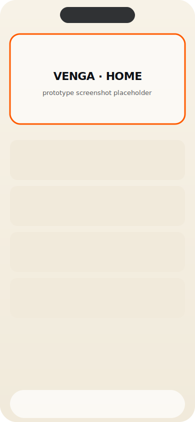
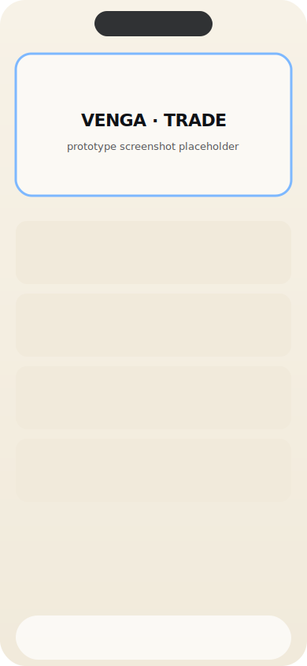
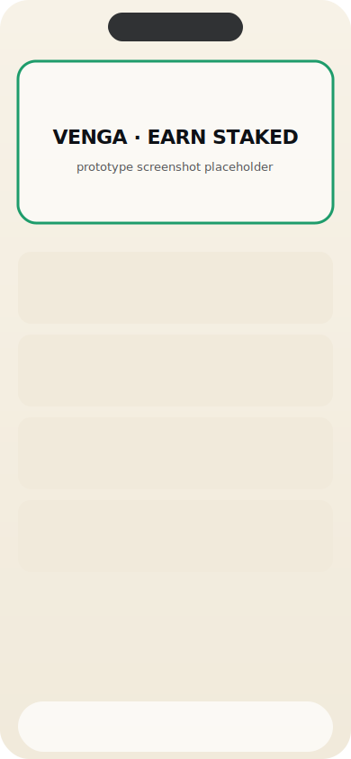
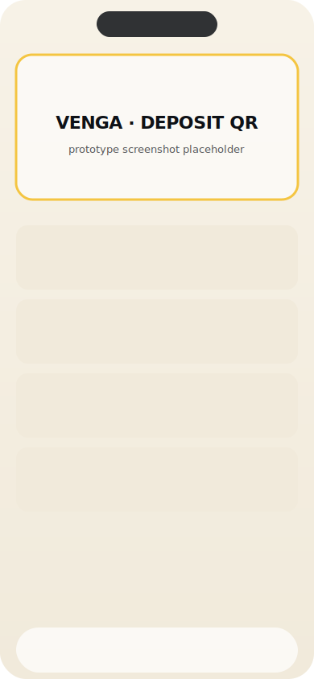

# Venga Mobile (Prototype)

A mobile-first web prototype of a redesigned consumer crypto app, built as a UX reference for the production roadmap.

[](https://vercel.com/new/clone?repository-url=https%3A%2F%2Fgithub.com%2F%3COWNER%3E%2Fvenga-mobile)

> Prototype only. Card payments and external-wallet flows are intentionally non-functional placeholders. Legal copy is placeholder, not binding. No real money moves.

<p>
  
  
  
  
</p>

## Demo

Open the deployed URL in a mobile browser. Or `npm run dev` and use Chrome DevTools mobile mode (390 × 844 recommended).

### Three flows to try

1. **Make a trade.** Home → Trade tab → keep From = EUR, type an amount → drag the "Slide to review" thumb → drag again on the review screen to confirm. Watch the rate ticker pulse and the success screen render with executed details.
2. **Stake an asset.** Home → Earn → Available → BTC → enter `0.0005` → Continue → review → slide to confirm. The new position appears on the Earn → Staked tab with a rainbow progress bar.
3. **Deposit crypto.** Home → Deposit tile → Crypto deposit → AAVE. Confirm the network in the compliance sheet (tick "Don't show again" if you'd like to skip it next time) → see the QR + address screen with copy/share/save.

To start over: **Menu → Reset prototype data** clears all local stakes, trades, picker selections, and the per-asset compliance acks.

## Local setup

```bash
npm install
npm run dev
# open http://localhost:3000
```

For mobile-style testing, open Chrome/Safari devtools, switch to a mobile viewport (390 × 844 or iPhone 14 Pro preset). On desktop ≥ 768px the app centers inside a 440px-wide phone-style frame so the layout stays honest to its target form factor.

### Common gotchas

- **Stale chunk 404s in the browser console** after switching between `npm run build` and `npm run dev` — fix with `rm -rf .next && npm run dev`, then hard-reload.
- **Port 3000 in use** — `lsof -ti:3000 | xargs kill -9` before restarting.

## Project structure (high level)

```
app/
  (shell)/        — tabbed screens (Home, Wallet, Trade, Earn) — share the bottom tab bar
  trade/          — Trade sub-routes (no tab bar)
  earn/           — Earn sub-routes (no tab bar)
  deposit/        — Deposit flow
  menu/           — Settings root + 18 sub-screens
  asset/[symbol]/ — asset detail
  error.tsx       — route-level error boundary
  not-found.tsx   — 404
  layout.tsx      — root html + ToastViewport + OfflineBanner mounts
components/
  screens/        — reusable settings screen scaffolds (SettingsList / Toggles / RadioList / Document)
  icons/          — 10 hand-built coin SVGs
  ...             — primitives + composites
lib/
  mocks.ts        — all in-memory data
  tradeStore.ts   — Zustand store for the trade flow
  earnStore.ts    — Zustand store for the stake flow
  toastStore.ts   — Global toast singleton
  motion.ts       — useReveal / useStagger (reduced-motion aware)
  haptics.ts      — Centralized vibration calls
  useBodyScrollLock.ts
  utils.ts, tokens.ts
CLAUDE.md         — canonical architecture reference; read this before making changes
```

## Architecture

Read [`CLAUDE.md`](./CLAUDE.md) for the full reference: design tokens, component library, screen inventory, conventions, and how to request edits without a full rebuild. New components and routes should be documented there as part of the change.

## Tech

- Next.js 14 (app router) · TypeScript strict · Tailwind CSS · Framer Motion · Zustand · Lucide React · Geist + Bricolage Grotesque fonts
- No backend — all data is mocked in-memory

## Status

Prototype, end of iter-7 polish pass. Card payments, external wallet integrations, real KYC review, and the legal copy are intentionally placeholders. Reward and price data is mocked.
